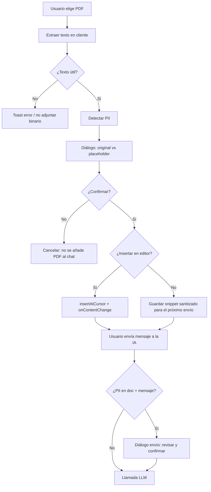

# Privacidad antes del LLM (PDF y PII)

Este documento describe el flujo acordado para **no enviar datos personales identificables (PII) en claro** al modelo cuando el origen es un **PDF** o el **texto del documento / mensaje** del usuario, dentro del asistente del editor de documentos.

## Objetivo

1. **PDF**: extraer texto en el cliente, detectar PII por patrones, sustituir por **placeholders estables** (`[NELAI_<TIPO>_001]`), mostrar un **diálogo de revisión** y solo tras **confirmación** continuar (insertar en el editor y/o incluir el texto sanitizado en el envío).
2. **Envío al modelo**: en ese turno **no se reenvía el PDF binario** (`inlineData`) cuando el contenido relevante ya va como **texto sanitizado**; las **imágenes** siguen pudiendo enviarse como hasta ahora.
3. **Mensaje + documento**: antes de llamar a la API, si el texto del usuario o el contenido plano del documento en contexto contienen PII detectables, se abre un **segundo diálogo** de revisión; al confirmar, el **system prompt** usa el documento anonimizado y el **último mensaje de usuario** el texto anonimizado (lo que ve el modelo coincide con lo mostrado en el chat para ese turno).

## Limitaciones (importante)

- La extracción de PDF usa **pdf.js** (texto embebido). **PDF escaneados** u **OCR** de baja calidad pueden devolver poco o ningún texto útil.
- La detección es **heurística por expresiones regulares** (correo, teléfono, DNI/NIE, IBAN tipo ES, RFC/CURP, etc.). **No sustituye** revisión humana ni cumplimiento legal; puede haber **falsos positivos** y **falsos negativos** (p. ej. nombres propios sin patrón estructurado).
- Los placeholders son **deterministas por orden de aparición** en ese análisis; si el texto cambia, los índices pueden cambiar.

## Rutas de código

| Área | Ruta |
|------|------|
| Extracción PDF + worker | `src/services/privacy/pdfTextExtract.ts` |
| Detección / anonimización | `src/services/privacy/piiDetect.ts`, `piiAnonymize.ts` |
| UI de revisión | `src/components/documents/PiiReviewPanel.tsx` (pestaña **Privacidad** del panel del asistente) |
| Integración chat / contexto | `src/components/documents/DocumentEditorAgent.tsx` |
| Cliente LLM (adjuntos) | `src/services/nelai/llmClient.ts` (el agente filtra PDF binario en el envío acordado) |

En el hilo, cada mensaje de usuario puede incluir `privacySubstitutions[]` (original, placeholder, `kind` heurístico y `source`: documento, mensaje o PDF importado) para auditoría en UI (pestaña **Privacidad**, botón **Ver mapeo**). No formaliza un esquema de tipos de PII a nivel producto.

**Nota de producto:** en cada envío exitoso al modelo, la lista que se guarda en el mensaje **fusiona** (sin duplicar token) las sustituciones del turno con **todas** las filas del registro de placeholders que siguen presentes en el texto del documento. Por eso el contador en la burbuja puede ser alto en mensajes posteriores aunque no se hayan detectado datos nuevos en ese turno: es transparencia del mapeo completo enviado a la IA, no solo “novedades”.

## Por qué el editor puede verse “igual” al PDF (sin `[NELAI_*]`)

El editor recibe **`sanitized`**, que en código es el texto tras sustituir **solo** lo que `detectPii` encuentra. Si **no hay coincidencias**, `sanitized` y el texto extraído del PDF son **el mismo string**: no es que se ignore la sanitización, sino que **no hubo nada que sustituir según los patrones actuales** (correo, teléfono, IBAN tipo ES, DNI/NIE, RFC/CURP, etc.).

Redacción típica de contratos mexicanos (“Nombre entidad”, “EL nombre”, montos en pesos, domicilios en prosa, folios de escritura) **suele no coincidir** solo con la capa de PII “clásico”. Para esa familia existe una **segunda capa** (pack genérico MX), opcional y documentada en **`docs/CONTRACT_SANITIZATION_DESIGN.md`** (`VITE_CONTRACT_MX_REDACT`).

## Flujo resumido (mermaid)

## Node.js

El proyecto declara `engines.node >= 20.19.0` por **Prisma 7.8**. Si `yarn install` falla en el paso de Prisma, actualiza Node o usa un entorno que cumpla la versión mínima.
